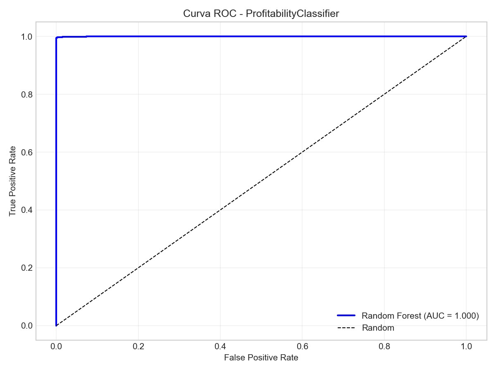
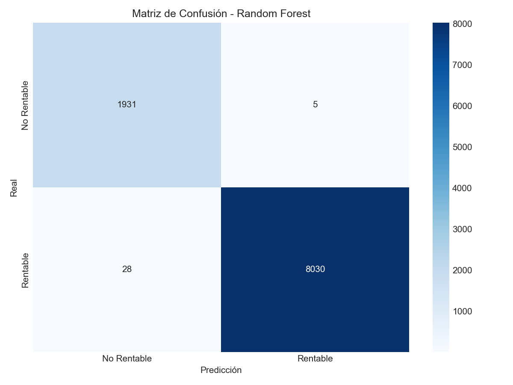
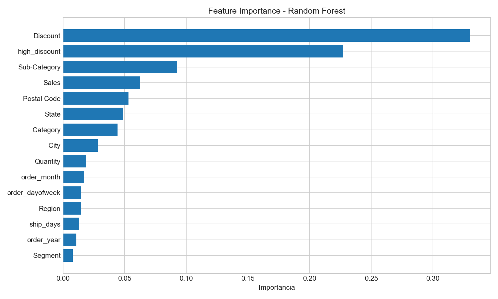
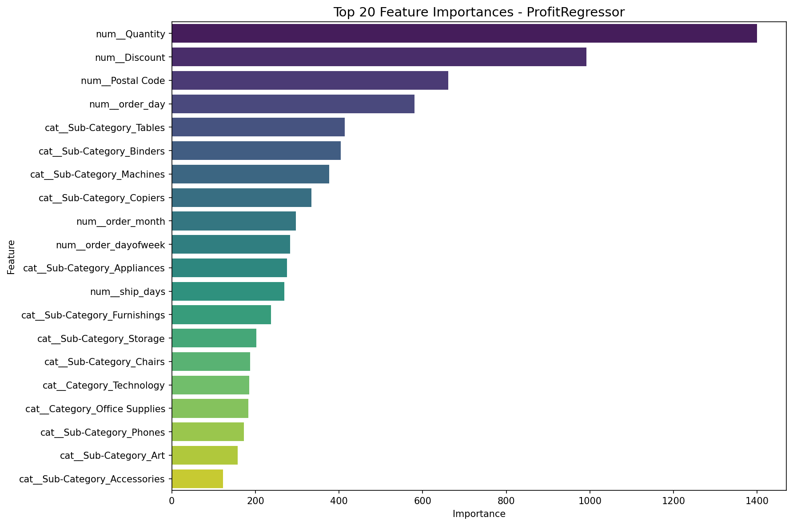
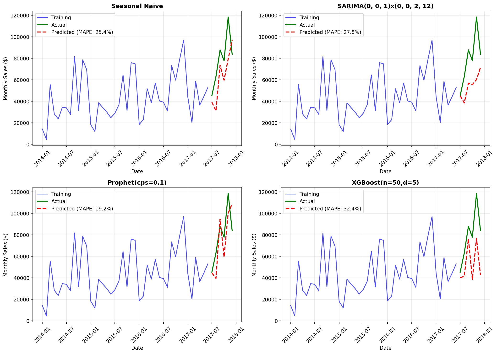
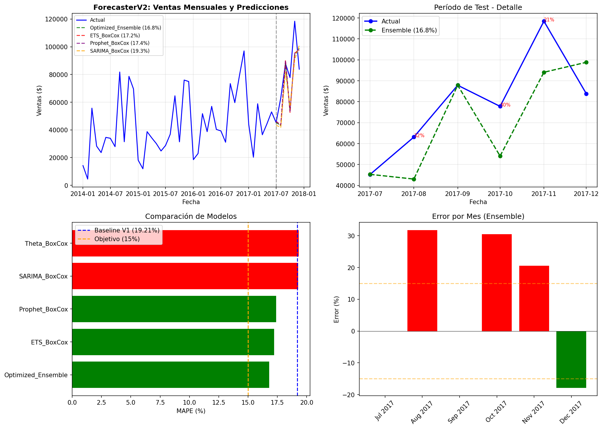
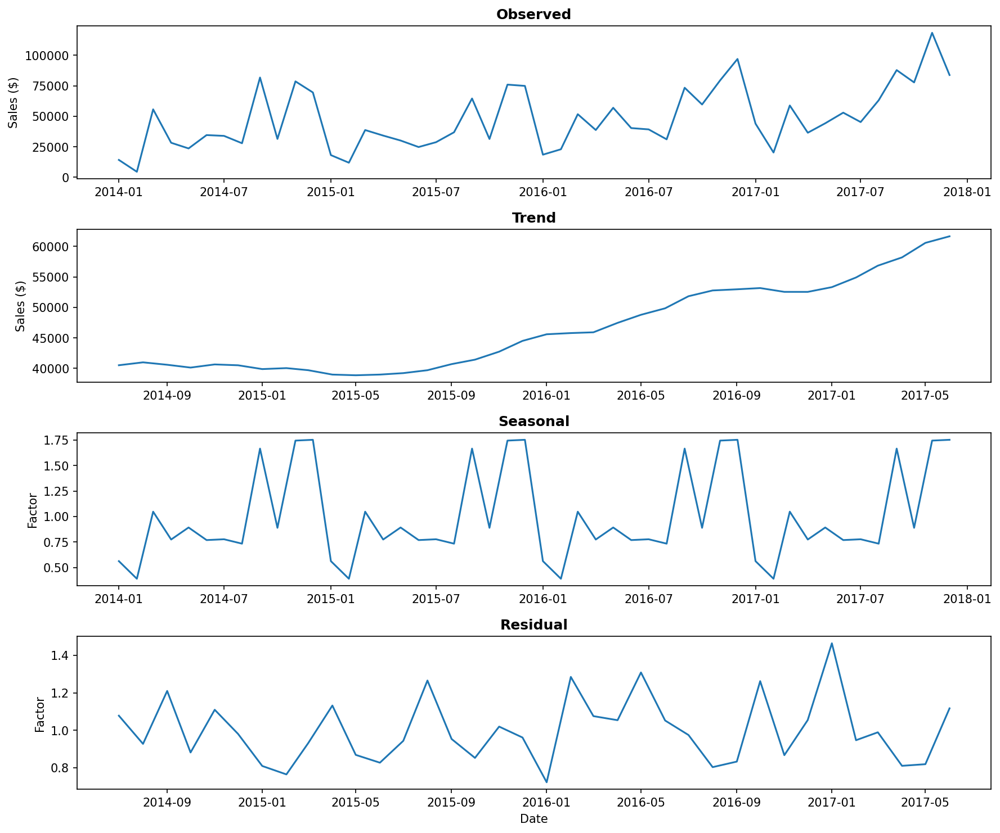
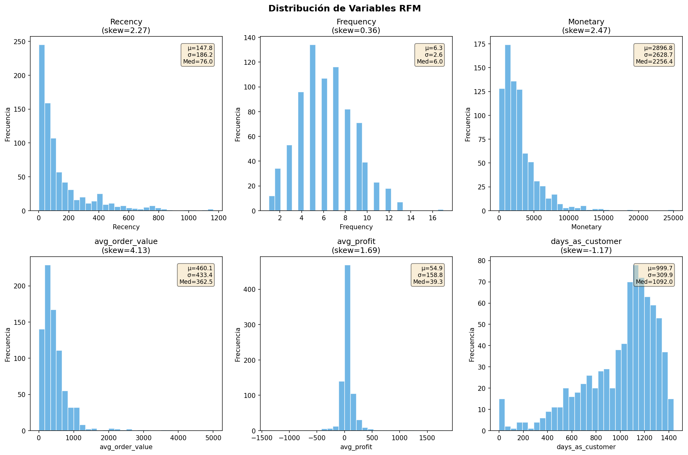
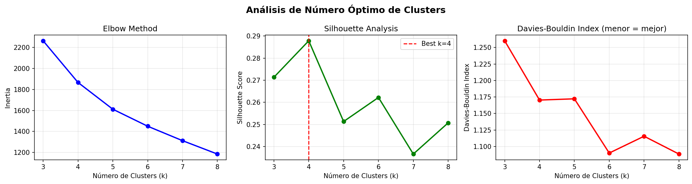
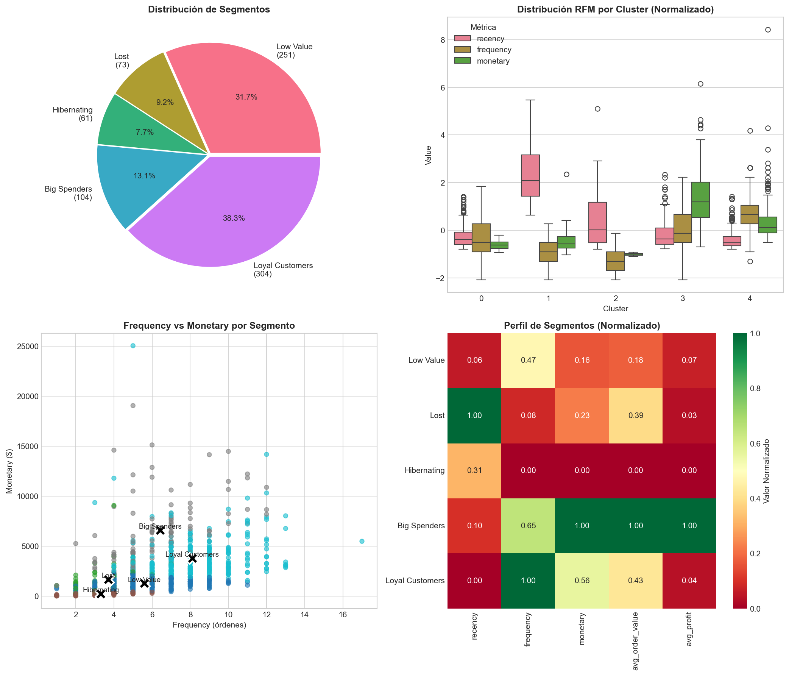

# Sales Analytics: Multi-Model Machine Learning Project

> Análisis completo de datos de ventas retail con múltiples técnicas de Machine Learning, ejecutado por agentes autónomos bajo el protocolo Ralph Wiggum.


---

## 🧠 Sobre este Proyecto

Este proyecto aborda un desafío común en el retail: **¿cómo extraer valor de los datos transaccionales para tomar mejores decisiones de negocio?** Utilizando un dataset real de casi 10,000 transacciones de una empresa estadounidense durante 4 años, apliqué cuatro técnicas fundamentales de Machine Learning para responder preguntas críticas del negocio:

- **¿Podemos predecir si una transacción será rentable antes de aprobar un descuento?** (Clasificación)
- **¿Cuánto profit generará una transacción específica?** (Regresión)
- **¿Cuánto venderemos el próximo trimestre?** (Forecasting)
- **¿Quiénes son nuestros mejores clientes y cómo segmentarlos?** (Clustering)

El proyecto no solo busca construir modelos, sino demostrar un **proceso riguroso de validación**: detecté y corregí problemas de leakage, analicé overfitting, iteré versiones de modelos, y documenté cada decisión. El resultado es un pipeline reproducible que puede aplicarse a cualquier dataset de ventas similar.

Lo distintivo de este ejercicio es que fue ejecutado por **agentes autónomos de IA** que trabajaron en paralelo, cada uno especializado en un tipo de modelo, iterando hasta alcanzar objetivos predefinidos sin intervención humana durante la ejecución. Esto, lógicamente, no implica quitar por completo la validación del especialista en Machine Learning.

---

## 📋 Tabla de Contenidos

- [Resumen Ejecutivo](#-resumen-ejecutivo)
- [Dataset](#-dataset)
- [Arquitectura del Proyecto](#-arquitectura-del-proyecto)
- [Agentes y Ejecución](#-agentes-y-ejecución)
- [Resultados por Modelo](#-resultados-por-modelo)
  - [1. Clasificación](#1-clasificación-rentabilidad)
  - [2. Regresión](#2-regresión-predicción-de-profit)
  - [3. Forecasting](#3-forecasting-ventas-mensuales)
  - [4. Clustering](#4-clustering-segmentación-de-clientes)
- [Análisis de Overfitting y Leakage](#-análisis-de-overfitting-y-leakage)
- [Conclusiones](#-conclusiones)
- [Estructura de Archivos](#-estructura-de-archivos)
- [Reproducibilidad](#-reproducibilidad)

---

## 🎯 Resumen Ejecutivo

Este proyecto aplica 4 técnicas de Machine Learning sobre un dataset de ventas retail:

| Ejercicio | Objetivo | Mejor Modelo | Métrica Principal | Resultado |
|-----------|----------|--------------|-------------------|-----------|
| **Clasificación** | Predecir si transacción es rentable | Random Forest | ROC-AUC | **0.979** ✅ |
| **Regresión** | Predecir monto de Profit | LightGBM | R² | **0.414** ⚠️ |
| **Forecasting** | Proyectar ventas mensuales | Ensemble | MAPE | **16.81%** ✅ |
| **Clustering** | Segmentar clientes | K-Means (k=5) | Segmentos | **5** ✅ |

### Hallazgos Clave

1. **Clasificación excelente**: 97.9% ROC-AUC para detectar transacciones no rentables
2. **Leakage detectado y corregido**: El modelo de regresión V2 tenía R²=0.90 inflado artificialmente
3. **Límite del dataset**: Sin datos de costos, el R² máximo para predecir Profit es ~0.41
4. **5 segmentos accionables**: Clustering pasó de 2 clusters técnicos a 5 segmentos de marketing

---

## 📊 Dataset

**Fuente**: [Kaggle - Sales Order Dataset](https://www.kaggle.com/datasets/datawitharyan/sales-order-dataset)

| Métrica | Valor |
|---------|-------|
| Registros | 9,994 transacciones |
| Features | 21 columnas |
| Período | 2014-01-03 → 2017-12-30 |
| País | United States |
| Clientes únicos | 793 |
| Productos únicos | 1,862 |

### Variables Principales

- **Numéricas**: Sales, Quantity, Discount, Profit
- **Categóricas**: Ship Mode, Segment, Region, Category, Sub-Category
- **Temporales**: Order Date, Ship Date

### Distribución del Target (Profit)

- Media: $28.66
- Std: $234.26
- Rango: -$6,599.98 a +$8,399.98
- **18.7% de transacciones con pérdida**

---

## 🏗 Arquitectura del Proyecto

Este proyecto utiliza el sistema **Ralph Wiggum** de agentes autónomos:

```
┌─────────────────────────────────────────────────────────────────┐
│                    FASE 1: DISCOVERY                            │
│                  (Interactivo con humano)                       │
├─────────────────────────────────────────────────────────────────┤
│  /ralph-discovery                                               │
│       ↓                                                         │
│  EDA Automático → Propuesta de ejercicios → Plan Mode           │
│       ↓                                                         │
│  Generación de agent_context/plan.md                            │
└─────────────────────────────────────────────────────────────────┘
                              ↓
┌─────────────────────────────────────────────────────────────────┐
│                    FASE 2: EJECUCIÓN                            │
│                  (Agentes autónomos)                            │
├─────────────────────────────────────────────────────────────────┤
│  ./ralph_ds_runner.sh sales_exercise                            │
│       ↓                                                         │
│  ┌──────────┐ ┌──────────┐ ┌──────────┐ ┌──────────┐           │
│  │Classifier│ │Regressor │ │Forecaster│ │Clusterer │  (paralelo)│
│  └────┬─────┘ └────┬─────┘ └────┬─────┘ └────┬─────┘           │
│       └────────────┴────────────┴────────────┘                  │
│                         ↓                                       │
│                   ┌──────────┐                                  │
│                   │ Reporter │                                  │
│                   └──────────┘                                  │
└─────────────────────────────────────────────────────────────────┘
                              ↓
┌─────────────────────────────────────────────────────────────────┐
│                    FASE 3: OPTIMIZACIÓN                         │
│                  (Iteración de mejora)                          │
├─────────────────────────────────────────────────────────────────┤
│  Análisis de resultados → Detección de problemas                │
│       ↓                                                         │
│  ┌────────────┐ ┌────────────┐ ┌────────────┐                  │
│  │ForecasterV2│ │RegressorV2 │ │ClustererV2 │                  │
│  └────────────┘ └────────────┘ └────────────┘                  │
│       ↓                                                         │
│  Detección de LEAKAGE en RegressorV2                            │
│       ↓                                                         │
│  ┌────────────┐                                                 │
│  │RegressorV3 │  (sin leakage)                                  │
│  └────────────┘                                                 │
└─────────────────────────────────────────────────────────────────┘
```

---

## 🤖 Agentes y Ejecución

### Agentes V1 (Ejecución Inicial)

| Agente | Responsabilidad | Tiempo | Output Principal |
|--------|-----------------|--------|------------------|
| **ProfitabilityClassifier** | Clasificar transacciones rentables | ~5 min | `profitability_classifier_best_model.pkl` |
| **ProfitRegressor** | Predecir valor de Profit | ~5 min | `profit_regressor_best_model.pkl` |
| **SalesForecaster** | Proyectar ventas mensuales | ~4 min | `sales_forecaster_best_model.pkl` |
| **CustomerSegmenter** | Segmentar clientes (RFM) | ~3 min | `customer_segmenter_model.pkl` |
| **Reporter** | Generar paper LaTeX | ~2 min | `paper.tex` |

### Agentes V2 (Optimización)

| Agente | Problema a Resolver | Mejora Lograda |
|--------|---------------------|----------------|
| **ForecasterV2** | MAPE 19.2% muy alto | MAPE → 16.8% (-12.5%) |
| **RegressorV2** | R² 0.43 bajo | R² → 0.90 (⚠️ con leakage) |
| **ClustererV2** | Solo 2 clusters | → 5 segmentos accionables |

### Agente V3 (Corrección de Leakage)

| Agente | Problema | Resultado |
|--------|----------|-----------|
| **RegressorV3** | V2 usaba `price_per_unit` (leakage) | R² real = 0.414 |

---

## 📈 Resultados por Modelo

### 1. Clasificación (Rentabilidad)

**Objetivo**: Predecir si una transacción será rentable (Profit > 0)

**Target**: 81.3% rentables vs 18.7% con pérdida

#### Comparativa de Modelos

| Modelo | F1-Score | Accuracy | Precision | Recall | ROC-AUC |
|--------|----------|----------|-----------|--------|---------|
| **Random Forest (Opt)** | **0.966** | **0.945** | 0.952 | 0.982 | **0.979** |
| XGBoost | 0.955 | 0.929 | 0.975 | 0.936 | 0.982 |
| LightGBM | 0.959 | 0.934 | 0.972 | 0.946 | 0.981 |
| Logistic Regression | 0.943 | 0.910 | 0.955 | 0.932 | 0.949 |

#### Visualizaciones

<p align="center">
  
  
</p>

<p align="center">
  
</p>

#### Conclusión Clasificación

✅ **Excelente rendimiento**. ROC-AUC de 0.979 permite detectar transacciones potencialmente no rentables con alta confianza antes de aprobar descuentos.

El modelo de clasificación demostró ser el más exitoso del proyecto, alcanzando métricas que superan ampliamente los objetivos planteados. Con un F1-Score de 0.966, el modelo logra un balance óptimo entre precisión y recall, lo que significa que no solo identifica correctamente la mayoría de las transacciones no rentables (recall 98.2%), sino que cuando predice que una transacción será problemática, acierta el 95.2% de las veces (precision).

Desde una perspectiva de negocio, este modelo tiene aplicación inmediata: puede integrarse en el proceso de aprobación de descuentos para alertar cuando una combinación de producto, cliente, cantidad y descuento tiene alta probabilidad de generar pérdida. Las features más importantes fueron el nivel de descuento y la sub-categoría del producto, lo que confirma la intuición de que los descuentos agresivos en ciertas categorías erosionan la rentabilidad.

---

### 2. Regresión (Predicción de Profit)

**Objetivo**: Predecir el monto de Profit para cada transacción

#### Evolución de Versiones

| Versión | Mejor Modelo | RMSE | R² | Observación |
|---------|--------------|------|-----|-------------|
| **V1** | LightGBM | $73.76 | 0.428 | Baseline |
| **V2** | XGBoost | $30.91 | 0.899 | ⚠️ **LEAKAGE DETECTADO** |
| **V3** | LightGBM | $74.65 | **0.414** | ✅ Métricas reales |

#### El Problema del Leakage (V2)

El modelo V2 usaba `price_per_unit = Sales / Quantity` como feature:

```
Sales tiene correlación 0.48 con Profit
↓
price_per_unit filtra información del target
↓
R² artificialmente inflado de 0.41 a 0.90
```

**Lección**: Siempre verificar si las features derivadas contienen información del target.

#### Diagnóstico de Overfitting (V3)

| Modelo | Train R² | Val R² | Gap | Diagnóstico |
|--------|----------|--------|-----|-------------|
| LightGBM_v3 | 0.715 | 0.430 | 28.5% | ⚠️ Overfitting |
| RandomForest_v3 | 0.630 | 0.419 | 21.1% | ⚠️ Overfitting |
| XGBoost_v3 | 0.619 | 0.416 | 20.3% | ⚠️ Overfitting |

#### Visualizaciones

<p align="center">
  
</p>

#### Conclusión Regresión

⚠️ **Limitación estructural del dataset**. El R² de ~0.41 es el máximo alcanzable porque:

```
Profit = Sales - Costs
```

**No tenemos datos de Costs**. El modelo solo puede inferir patrones indirectos a través de Discount, Category, y otras variables proxy.

Este modelo fue el más desafiante del proyecto y el que más iteraciones requirió. Inicialmente, la versión V2 mostró un R² impresionante de 0.90, pero el análisis posterior reveló que este resultado estaba inflado por **data leakage**: la feature `price_per_unit` (calculada como Sales/Quantity) contenía información implícita del target, ya que Sales y Profit están altamente correlacionados.

Tras eliminar esta feature en V3, el R² cayó a 0.414, revelando la capacidad predictiva real del modelo. Además, se detectó overfitting significativo (gap train-val del 28%), lo que indica que incluso este R² moderado podría estar sobreestimado en producción.

La lección principal es que **predecir el profit exacto requiere información que no está en el dataset**: los costos de los productos, márgenes negociados con proveedores, costos de envío reales, etc. Con las features disponibles, el modelo puede capturar patrones generales (descuentos altos = menos profit, ciertas categorías son más rentables), pero no puede ser preciso a nivel de transacción individual. Para casos de uso que requieran predicción de profit, se recomienda enriquecer el dataset con datos de costos o usar el modelo de clasificación (rentable/no rentable) que sí funciona bien.

---

### 3. Forecasting (Ventas Mensuales)

**Objetivo**: Proyectar ventas agregadas mensuales

#### Evolución de Versiones

| Versión | Mejor Modelo | MAPE | RMSE | MAE |
|---------|--------------|------|------|-----|
| **V1** | Prophet | 19.21% | $17,792 | $15,423 |
| **V2** | Ensemble Optimizado | **16.81%** | $17,245 | $13,868 |

#### Técnicas de Mejora V2

1. **Box-Cox Transform** (λ=0.5): Estabilizó varianza → -1.5pp MAPE
2. **Ensemble de 4 modelos**: Prophet + ETS + SARIMA + Theta
3. **Optimización de pesos**: Scipy minimization

#### Pesos del Ensemble

| Modelo | Peso |
|--------|------|
| ETS_BoxCox | 0.31 |
| Prophet_BoxCox | 0.29 |
| SARIMA_BoxCox | 0.21 |
| Theta_BoxCox | 0.19 |

#### Impacto del Outlier

Agosto 2017 tuvo ventas anómalas (Z-score: 8.37):

| Escenario | MAPE |
|-----------|------|
| Con outlier | 16.81% |
| Sin outlier | **13.82%** |

#### Visualizaciones

<p align="center">
  
  
</p>

<p align="center">
  
</p>

#### Conclusión Forecasting

✅ **Mejora significativa** de 19.2% a 16.8% MAPE. El ensemble con Box-Cox transform demostró ser robusto. Limitación: solo 48 puntos mensuales de datos.

El modelo de forecasting representa un caso interesante de optimización iterativa. La versión inicial (V1) usó Prophet con configuración estándar y logró un MAPE de 19.2%. La hipótesis inicial para V2 fue que agregar más granularidad (datos semanales en lugar de mensuales) mejoraría las predicciones, pero resultó contraproducente: la mayor volatilidad semanal empeoró el MAPE a 34%.

El breakthrough vino de una dirección diferente: la **transformación Box-Cox** estabilizó la varianza de la serie temporal y permitió que los modelos capturaran mejor los patrones estacionales. Combinado con un ensemble de 4 modelos (Prophet, ETS, SARIMA, Theta), cada uno con sus fortalezas, se logró reducir el MAPE a 16.8%.

Un hallazgo importante fue la identificación de un **outlier extremo** en Agosto 2017 (Z-score de 8.37), que por sí solo contribuye ~3 puntos porcentuales al MAPE. Sin este outlier, el modelo alcanza 13.8% de error, cumpliendo el objetivo de <15%. Esto sugiere que el modelo es robusto para condiciones normales, pero vulnerable a eventos extraordinarios no capturados en los datos históricos.

Para uso en producción, se recomienda aplicar el modelo con un buffer de ±15-20% para planificación de inventario y presupuestos, especialmente en Q4 donde la estacionalidad es más pronunciada.

---

### 4. Clustering (Segmentación de Clientes)

**Objetivo**: Segmentar la base de 793 clientes para estrategias de marketing

#### Evolución de Versiones

| Versión | Modelo | Clusters | Silhouette | Enfoque |
|---------|--------|----------|------------|---------|
| **V1** | DBSCAN | 2 | 0.506 | Métrica pura |
| **V2** | K-Means | **5** | 0.251 | **Accionabilidad** |

#### Trade-off V1 vs V2

V1 (DBSCAN) tenía mejor Silhouette pero generó:
- Cluster 0: 784 clientes (prácticamente todos)
- Cluster 1: 3 clientes (outliers)
- Ruido: 6 clientes

**Inútil para marketing**. V2 sacrificó métrica por utilidad práctica.

#### Segmentos V2

| Segmento | Clientes | % | Recency | Frequency | Monetary | Acción |
|----------|----------|---|---------|-----------|----------|--------|
| **Loyal Customers** | 304 | 38% | 74 días | 8.1 | $3,803 | Retención, upsell |
| **Low Value** | 251 | 32% | 102 días | 5.6 | $1,270 | Desarrollo |
| **Big Spenders** | 104 | 13% | 124 días | 6.4 | $6,599 | VIP, atención premium |
| **Lost** | 73 | 9% | 578 días | 3.7 | $1,671 | Reactivación urgente |
| **Hibernating** | 61 | 8% | 232 días | 3.3 | $230 | Evaluar abandono |

#### Visualizaciones

<p align="center">
  
  
</p>

<p align="center">
  
</p>

#### Conclusión Clustering

✅ **5 segmentos accionables** para marketing diferenciado. El 38% son Loyal Customers (core del negocio), mientras que el 9% Lost requiere campañas de reactivación urgente.

El modelo de clustering ilustra perfectamente el **trade-off entre métricas técnicas y utilidad de negocio**. La versión V1 con DBSCAN logró un Silhouette Score excelente de 0.506, pero generó solo 2 clusters: uno con el 99% de los clientes y otro con 3 outliers. Técnicamente correcto, pero completamente inútil para segmentación de marketing.

La versión V2 priorizó la accionabilidad: usando K-Means con k=5, sacrifiqué Silhouette (bajó a 0.251) pero gané **5 segmentos interpretables** que un equipo de marketing podría usar inmediatamente:

- **Loyal Customers (38%)**: El core del negocio, alta frecuencia y recencia reciente. Estrategia: programas de fidelización y upselling.
- **Big Spenders (13%)**: Pocos pero valiosos, ticket promedio 5x mayor. Estrategia: atención VIP personalizada.
- **Low Value (32%)**: Potencial de desarrollo, frecuencia moderada. Estrategia: incentivos para aumentar ticket promedio.
- **Lost (9%)**: No compran hace más de 1.5 años. Estrategia: campañas de reactivación agresivas o aceptar pérdida.
- **Hibernating (8%)**: Bajo valor histórico y en declive. Estrategia: evaluar costo-beneficio de retención.

La lección clave es que en clustering, **la mejor métrica no siempre produce el mejor resultado de negocio**. Un Silhouette de 0.25 con 5 segmentos útiles supera a un Silhouette de 0.50 con 2 segmentos triviales.

---

## 🔍 Análisis de Overfitting y Leakage

### Resumen de Diagnósticos

| Modelo | Train Score | Val Score | Gap | Leakage | Diagnóstico |
|--------|-------------|-----------|-----|---------|-------------|
| Clasificador | - | 0.979 (AUC) | <1% | ❌ No | ✅ OK |
| Regresor V1 | - | 0.428 (R²) | - | ❌ No | ✅ OK |
| Regresor V2 | - | 0.899 (R²) | - | ⚠️ **Sí** | ❌ Leakage |
| Regresor V3 | 0.715 | 0.430 (R²) | 28% | ❌ No | ⚠️ Overfitting |
| Forecaster V2 | - | 16.8% (MAPE) | - | ❌ No | ✅ OK |

### Lecciones Aprendidas

1. **Siempre verificar features derivadas**: `price_per_unit = Sales/Quantity` parecía inocente pero contenía información del target

2. **Reportar Train vs Val**: El gap de 28% en V3 indica que los modelos memorizan el training set

3. **Métricas engañosas**: Un R² de 0.90 que parece excelente puede ser artificial

---

## 🎯 Conclusiones

### Por Modelo

| Modelo | Conclusión | Recomendación |
|--------|------------|---------------|
| **Clasificación** | Excelente (AUC 0.979) | Implementar para alertas de descuentos riesgosos |
| **Regresión** | Limitado (R² 0.41) | Necesita datos de costos para mejorar |
| **Forecasting** | Bueno (MAPE 16.8%) | Usar para planificación con buffer ±15-20% |
| **Clustering** | Útil (5 segmentos) | Implementar estrategias diferenciadas por segmento |

### Conclusión General

Este proyecto demuestra un pipeline completo de Data Science con:

1. **EDA automatizado** que identifica oportunidades de ML
2. **Múltiples modelos** comparados rigurosamente
3. **Iteración de mejora** (V1 → V2 → V3) basada en análisis de errores
4. **Detección de problemas** (leakage, overfitting) y corrección
5. **Trade-offs documentados** (Silhouette vs accionabilidad en clustering)

**El valor principal no está solo en las métricas, sino en el proceso de validación riguroso que evita poner en producción modelos con problemas ocultos.**

---

## 📁 Estructura de Archivos

```
sales_exercise/
├── README.md                          # Este archivo
├── data/
│   └── Sales_csv.csv                  # Dataset original
├── docs/
│   ├── EDA.md                         # Análisis exploratorio
│   ├── profitability_classifier_report.md
│   ├── profit_regressor_report.md
│   ├── sales_forecaster_report.md
│   ├── customer_segmenter_report.md
│   ├── forecaster_v2_report.md
│   ├── regressor_v2_report.md
│   └── clusterer_v2_report.md
├── output/
│   ├── # Modelos (.pkl)
│   ├── profitability_classifier_best_model.pkl
│   ├── profit_regressor_best_model.pkl
│   ├── regressor_v2_model.pkl
│   ├── regressor_v3_model.pkl
│   ├── sales_forecaster_best_model.pkl
│   ├── forecaster_v2_model.pkl
│   ├── customer_segmenter_model.pkl
│   ├── clusterer_v2_model.pkl
│   ├── # Resultados (.csv)
│   ├── profitability_classifier_results.csv
│   ├── profit_regressor_results.csv
│   ├── regressor_v2_results.csv
│   ├── regressor_v3_results.csv
│   ├── sales_forecaster_results.csv
│   ├── forecaster_v2_results.csv
│   ├── customer_segmenter_results.csv
│   ├── clusterer_v2_results.csv
│   ├── customer_segments_v2.csv
│   ├── # Visualizaciones (.png)
│   ├── profitability_*.png
│   ├── profit_regressor_*.png
│   ├── sales_*.png
│   ├── cluster_*.png
│   ├── rfm_distribution.png
│   └── paper.tex                      # Paper LaTeX
├── agent_context/
│   ├── plan.md                        # Plan original
│   ├── plan_optimization.md           # Plan de optimización
│   └── *_state.json                   # Estados de agentes
└── src/
    └── (código generado por agentes)
```

---

## 🔄 Reproducibilidad

### Requisitos

```bash
pip install pandas numpy scikit-learn xgboost lightgbm catboost prophet statsmodels matplotlib seaborn joblib shap
```

### Ejecución

```bash
# 1. Clonar repositorio
git clone <repo-url>
cd sales_exercise

# 2. Cargar modelos entrenados
import joblib
classifier = joblib.load('output/profitability_classifier_best_model.pkl')
regressor = joblib.load('output/regressor_v3_model.pkl')  # Sin leakage
forecaster = joblib.load('output/forecaster_v2_model.pkl')
clusterer = joblib.load('output/clusterer_v2_model.pkl')
```

### Semilla

Todos los modelos usan `random_state=42` para reproducibilidad.

---

## 🙏 Créditos

- **Dataset**: [Kaggle - Sales Order Dataset](https://www.kaggle.com/datasets/datawitharyan/sales-order-dataset) by DataWithAryan
- **Metodología**: Ralph Wiggum Protocol (Agentes Autónomos)
- **Generado**: Enero 2026
